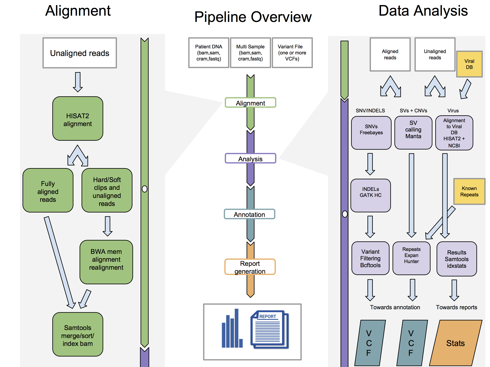

# DNA-NGS-scan

## Introduction

DNAscan is a fast and efficient bioinformatics pipeline that allows for the analysis of DNA Next Generation sequencing data, requiring very little computational effort and memory usage. DNAscan can analyse raw whole genome NGS data in ~8 hours, using as little as 4 cpus and ~4 Gbs of RAM while guaranteeing a very high performance. We do this by exploiting state-of-the-art bioinformatics tools. DNAscan can screen your DNA NGS data for single nucleotide variants, small indels, structural variants, repeat expansions, viral (or any other organism’s) genetic material. Its results are annotated using a wide range of databases including ClinVar, EXAC, dbSNP and CADD and uploaded onto the gene.iobio platform for an on-the-fly analysis/interpretation.

Figure 1. Central panel: Pipeline overview. DNAscan accepts sequencing data, and optionally variant files. The pipeline firstly perform an alignment step (details in the left panel), followed by a customizable data analysis protocol (details in the right panel). Finally, results are annotated and a user friendly report is generated. Right panel: detailed description of the post alignment analysis pipeline (intensive mode). Aligned reads are used by the variant calling pipeline (Freebayes + GATK HC + Bcftools), both aligned and unaligned reads are used by Manta and ExpensionHunter (for which know repeat description files have to be provided)  to look for structural variants. The unaligned reads are mapped to a database of known viral genomes (NCBI database) to screen for the presence of their genetic material in the input sequencing data. Left panel: Alignment stage description. Raw reads are aligned with HISAT2. Resulting soft/hard-clipped reads and unaligned reads are realigned with BWA mem and then merged with the others using samtools.

## Documentation

#### **[Installation](docs/installation.md)**
#### **[Usage](docs/usage.md)**

## Citation

[Alfredo Iacoangeli et al. DNA: a fast, computationally and memory efficient bioinformatics pipeline for analysis of DNA next-generation-sequencing data. Bioinformatics, 2017](https://docs.google.com/document/d/1a_ueKKppMb1AwInsW4UL2XtmtBuztbbRbhSguTieYg4/edit?usp=sharing)

## Core Contributors

- [Dr Alfredo Iacoangeli](alfredo.iacoangeli@kcl.ac.uk), UK
- [Dr Stephen J Newhouse](stephen.j.newhouse@gmail.com), UK

### Contributors
For a full list of contributors see [LINK](./CONTRIBUTORS.md)

## Contributing

Here’s how we suggest you go about proposing a change to this project:

1. [Fork this project][fork] to your account.
2. [Create a branch][branch] for the change you intend to make.
3. Make your changes to your fork.
4. [Send a pull request][pr] from your fork’s branch to our `master` branch.

Using the web-based interface to make changes is fine too, and will help you
by automatically forking the project and prompting to send a pull request too.

[fork]: https://help.github.com/articles/fork-a-repo/
[branch]: https://help.github.com/articles/creating-and-deleting-branches-within-your-repository
[pr]: https://help.github.com/articles/using-pull-requests/

## Licence 
- [MIT](./LICENSE.txt)

*********

  Core Developers funded as part of:  
  <a href="https://www.mndassociation.org/">MNDA</a>  
  <a href="http://www.maudsleybrc.nihr.ac.uk/">NIHR Maudsley Biomedical Research Centre (BRC), King's College London</a> 
  <a href="http://www.ucl.ac.uk/health-informatics/">Farr Institute of Health Informatics Research, UCL Institute of Health Informatics, University College London</a>

